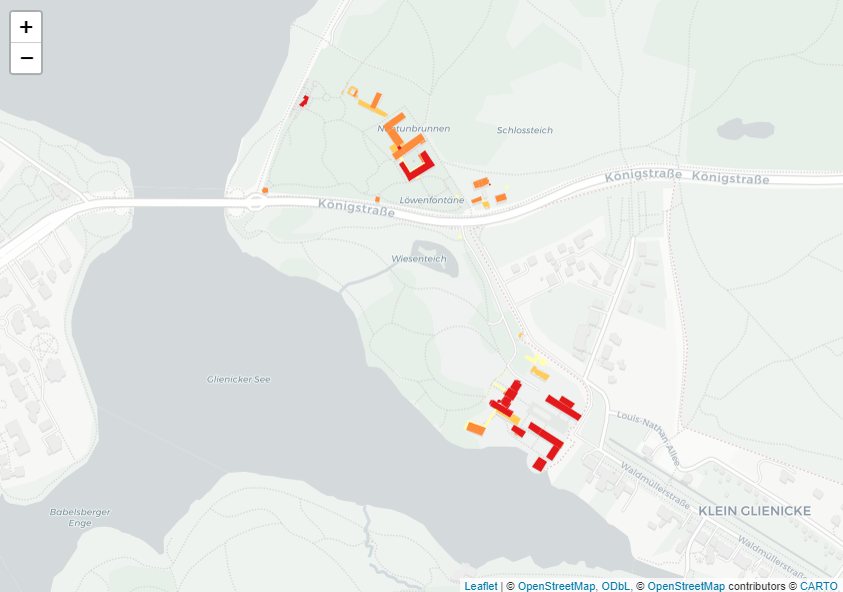
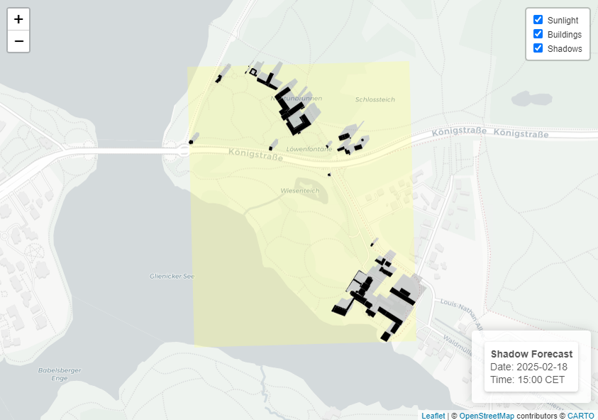

# ShadowMapR
ShadowMapR allows users to **calculate and visualize building shadows** based on sunlight exposure and shadowed areas using **XML or GML data**.

## Key Features
Designed for **3D building models** in **LoD0** and **LoD2** formats from Germany (*LoD0-DE and LoD2-DE*), this package provides functions to:

- Process `.xml` or `.gml` files containing building geometries (*POLYGON*) and height information
- Compute centroids of building geometries
- Determine solar position (*azimuth and elevation*) using `suntools`
- Calculate building shadows for a specific time or generate an hourly shadow progression over a day
- Generate an interactive map displaying sunlight and shadow areas using `leaflet`

## Usage
Users can analyze shadows at specific times or visualize their evolution throughout the day, making it ideal for urban planning, solar analysis, and environmental studies.

⚠ **Limitations:**
This package **does not** account for **terrain elevation** or **vegetation shadows**. It assumes all buildings are placed on a **flat surface**.


## Installation

### From GitHub 
```r
# install.packages("remotes") # if not already installed
remotes::install_github("agneszwick/ShadowMapR")
```
## Example
### Use example file 
```r
# Load package
library(ShadowMapR)

# Process example file
building_sf <- get_example_data()

# CRS code detected: 
# Processing XML file: 
# XML extraction completed in 7.66 seconds.
# Number of geometries before validation: 1057
# Number of geometries after validation: 214
# Number of valid geometries after simplification: 182
# Convert to 2D completed in 0.3 seconds.
# Number of valid geometries after cleaning: 90
# Cleaning completed in 1.88 seconds.

# Visualize building_sf in leaflet map
visualize_buildings(building_sf)


```
This image is a screenshot of the interactive Leaflet map showing the visualization of the processed building data.



### Use your own file(s)

```r
# Load package
library(ShadowMapR)

# Define file path
file_path <- "path/to/your/xml/or/gml/file"

# Extract crs of file
crs_code <- extract_crs(file_path)
print(crs)
# (e.g.) 25832 

# Process xml/gml file and create simple feature 
building_sf <- load_building_data(file_path, crs_code)

# Visualize building_sf in leaflet map
visualize_buildings(building_sf)
```

### Calculate sun elevation and azimuth at defined time

```r
time <- as.POSIXct("yyyy-mm-dd hh:mm:ss", tz = "Europe/Berlin")
# time <- as.POSIXct("2025-02-18 15:00:00", tz = "Europe/Berlin")

building_sf <- sun_position(building_sf, time)
```
### Calculate building offset based on shadow length/position
```r
building_offset <- calculate_all_shadows(building_sf)
```

### Create shadow map with sun, shadow and building polygons
```r
shadow_map <- create_building_shadow_map(building_offset, time, batch_size = 100)
shadow_map
# This image is a screenshot of the interactive Leaflet map showing the visualization of the shadow and sunlight areas.
```

