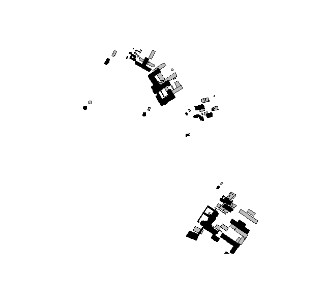

---
output:
  pdf_document: default
  html_document: default

# ShadowMapR
ShadowMapR allows users to **calculate and visualize building shadows** based on sunlight exposure and shadowed areas using **XML or GML data**.

## Key Features
Designed for **3D building models** in **LoD0** and **LoD2** formats from Germany (*LoD0-DE and LoD2-DE*), this package provides functions to:

- Process `.xml` or `.gml` files containing building geometries (*POLYGON*) and height information
- Compute centroids of building geometries
- Determine solar position (*azimuth and elevation*) using `suntools`
- Calculate building shadows for a specific time or generate an hourly shadow progression over a day
- Generate an interactive map displaying sunlight and shadow areas using `leaflet`

## Usage
Users can analyze shadows at specific times or visualize their evolution throughout the day, making it ideal for urban planning, solar analysis, and environmental studies.

⚠ **Limitations:**
This package **does not** account for **terrain elevation** or **vegetation shadows**. It assumes all buildings are placed on a **flat surface**.


## Installation

**From GitHub** 
```r
# install.packages("remotes") # if not already installed
remotes::install_github("agneszwick/ShadowMapR")
```
## Example
```r
library(ShadowMapR)

# Define file path
file_path <- "path/to/your/xml/or/gml/file"
crs_code <- extract_crs(file_path)
building_sf <- load_building_data(file_path, crs_code)

# OR: Use example file
building_sf <- get_example_data()

# Visualize data  
visualize_buildings(building_sf)

# Define time 
time <- as.POSIXct("2025-02-18 15:00:00", tz = "Europe/Berlin")

# Calculate azimuth and elevation of sun at defined time
building_sf <- sun_position(building_sf, time)

# Calculate shadow offset
buildings_with_shadows <- building_offset(building_sf)

# Display final map with sunny and shaded areas at defined time
shadow_map <- create_building_shadow_map(buildings_with_shadows, time, batch_size = 100)
shadow_map
```

## Detailed Explanation 
```r
# Load package
library(ShadowMapR)

# Define file path
file_path <- "path/to/your/xml/or/gml/file"

# Extract crs of file
crs_code <- extract_crs(file_path)
print(crs)
# (e.g.) 25832 
```

**`extract_crs`**

This function extracts the coordinate reference system (CRS) from a GML or XML file, reading the `srsName` attribute from the `<gml:Envelope>` element.

```r
# Process xml/gml file and create simple feature 
building_sf <- load_building_data(file_path, crs_code)
```

**`load_building_data`**

@param *path*: Path to the directory or file containing the files.

@param *crs_code*: Character string. The coordinate reference system (CRS) code to be used.

- `.gml` file
  - `extract_gml_polygons`: reads a `.gml` file and extracts *geometry* and *measuredHeight* of buildings
  - @output Simple feature with *part_id*, *geometry* and *height* column
 
- `.xml` file
  - `extract_xml_polygons`: Creates data frame of building data from an XML file
  - `convert_to_2D`: Creates simple feature of 2D building polygons
  - `clean_building_polygons`: Clean building polygon geometries by grouping and summarizing them
  - @output: Simple feature with *bldg_id*, *part_id*, *geometry*, *height* and *file* column


**Alternative with example file**
```r
# Process example file
building_sf <- get_example_data()

# > print(building_sf)
# Simple feature collection with 91 features and 4 fields
# Geometry type: POLYGON
# Dimension:     XY
# Bounding box:  xmin: 370231.4 ymin: 5808336 xmax: 370921.3 ymax: 5808949
# Projected CRS: ETRS89 / UTM zone 33N
# # A tibble: 91 × 5
#    part_id                                                   geometry height bldg_id file 
#  * <chr>                                                <POLYGON [m]>  <dbl> <chr>   <chr>
#  1 DEBE06YYD00000lo_01 ((370455.6 5808769, 370461 5808772, 370462.2 …   3.37 DEBE06… exam…
#  2 DEBE06YYD00001AQ    ((370571.2 5808740, 370584.9 5808743, 370587.…   8.00 DEBE06… exam…
#  3 DEBE06YYD00001Ai_01 ((370551.1 5808764, 370559.8 5808766, 370562.…   7.99 DEBE06… exam…
#  4 DEBE06YYD00001Gw    ((370538.5 5808760, 370547.2 5808763, 370549.…   8.50 DEBE06… exam…
#  5 DEBE06YYD00001hw_01 ((370555 5808436, 370560 5808443, 370589.2 58…  21.2  DEBE06… exam…
#  6 DEBE06YYD00001hw_02 ((370582.5 5808413, 370589 5808423, 370600.5 …   5.27 DEBE06… exam…
#  7 DEBE06YYD00001hw_03 ((370574.9 5808452, 370581.2 5808461, 370582.…   7.49 DEBE06… exam…
#  8 DEBE06YYD00001hw_04 ((370584.6 5808399, 370590.2 5808407, 370606.…  12.2  DEBE06… exam…
#  9 DEBE06YYD00001hw_05 ((370554.2 5808439, 370557.6 5808444, 370558.…  10.2  DEBE06… exam…
# 10 DEBE06YYD00002gi    ((370395.3 5808737, 370395.5 5808738, 370396 …   6.37 DEBE06… exam…
# # ℹ 81 more rows
# # ℹ Use `print(n = ...)` to see more rows

```
**`get_example_data()`** 

1. Set file path to example.xml
2. Extract CRS code from the example `extract_crs`
3. Runs `load_building_data`


```r
visualize_buildings(building_sf)
```
This image is a screenshot of the interactive Leaflet map showing the visualization of the processed building data.


```r
time <- as.POSIXct("yyyy-mm-dd hh:mm:ss", tz = "Europe/Berlin")
# time <- as.POSIXct("2025-02-18 15:00:00", tz = "Europe/Berlin")

building_sf <- sun_position(building_sf, time)

# > head(building_sf)
# Simple feature collection with 6 features and 8 fields
# Geometry type: POLYGON
# Dimension:     XY
# Bounding box:  xmin: 370455.6 ymin: 5808405 xmax: 370600.5 ymax: 5808772
# Projected CRS: ETRS89 / UTM zone 33N
# A tibble: 6 × 9
#  part_id                   geometry height bldg_id file  sol_azimuth sol_elevation centroid_lon
#  <chr>                <POLYGON [m]>  <dbl> <chr>   <chr>       <dbl>         <dbl>        <dbl>
# 1 DEBE06Y… ((370455.6 5808769, 3704…   3.37 DEBE06… exam…        221.          17.7         13.1
# 2 DEBE06Y… ((370571.2 5808740, 3705…   8.00 DEBE06… exam…        221.          17.7         13.1
# 3 DEBE06Y… ((370551.1 5808764, 3705…   7.99 DEBE06… exam…        221.          17.7         13.1
# 4 DEBE06Y… ((370538.5 5808760, 3705…   8.50 DEBE06… exam…        221.          17.7         13.1
# 5 DEBE06Y… ((370555 5808436, 370560…  21.2  DEBE06… exam…        221.          17.7         13.1
# 6 DEBE06Y… ((370582.5 5808413, 3705…   5.27 DEBE06… exam…        221.          17.7         13.1
# # ℹ 1 more variable: centroid_lat <dbl>
```
**`sun_position(building_sf, time)`**

@param *building_sf*: An sf object containing building geometries.

@param *time*: A POSIXct object representing the time for which to calculate the solar position.

This function calculates the solar position for the provided building data and time. 

- `calc_centroids`: Calculates centroids of sf polygons
- `calc_solar_pos`: Calculates solar position (*sol_azimuth* and *sol_elevation*) of the centroids
  
@output: An `sf` object containing building geometries and solar positions (*sol_azimuth* and *sol_elevation*).


```r
buildings_with_shadows <- building_offset(building_sf)

# > head(buildings_with_shadows)
# Simple feature collection with 6 features and 8 fields
# Active geometry column: geometry
# Geometry type: POLYGON
# Dimension:     XY
# Bounding box:  xmin: 370455.6 ymin: 5808405 xmax: 370600.5 ymax: 5808772
# Projected CRS: ETRS89 / UTM zone 33N
# # A tibble: 6 × 10
#   part_id                                                                                     geometry height bldg_id file  sol_azimuth sol_elevation centroid_lon centroid_lat           shadow_geometry
#   <chr>                                                                                  <POLYGON [m]>  <dbl> <chr>   <chr>       <dbl>         <dbl>        <dbl>        <dbl>             <POLYGON [m]>
# 1 DEBE06YYD00000lo_01 ((370455.6 5808769, 370461 5808772, 370462.2 5808770, 370456.7 5808767, 370455.…   3.37 DEBE06… exam…        221.          17.7         13.1         52.4 ((370462.5 5808777, 3704…
# 2 DEBE06YYD00001AQ    ((370571.2 5808740, 370584.9 5808743, 370587.4 5808734, 370573.7 5808731, 37057…   8.00 DEBE06… exam…        221.          17.7         13.1         52.4 ((370587.6 5808759, 3706…
# 3 DEBE06YYD00001Ai_01 ((370551.1 5808764, 370559.8 5808766, 370562.3 5808758, 370561.7 5808757, 37056…   7.99 DEBE06… exam…        221.          17.7         13.1         52.4 ((370567.5 5808783, 3705…
# 4 DEBE06YYD00001Gw    ((370538.5 5808760, 370547.2 5808763, 370549.8 5808753, 370541.2 5808751, 37053…   8.50 DEBE06… exam…        221.          17.7         13.1         52.4 ((370556 5808780, 370564…
# 5 DEBE06YYD00001hw_01 ((370555 5808436, 370560 5808443, 370589.2 5808423, 370584.3 5808416, 370555 58…  21.2  DEBE06… exam…        221.          17.7         13.1         52.4 ((370598.6 5808486, 3706…
# 6 DEBE06YYD00001hw_02 ((370582.5 5808413, 370589 5808423, 370600.5 5808415, 370593.4 5808405, 370590.…   5.27 DEBE06… exam…        221.          17.7         13.1         52.4 ((370593.3 5808426, 3705…

plot(st_geometry(buildings_with_shadows$shadow_geometry), col = "grey")
plot(st_geometry(buildings_with_shadows), add = TRUE, col = "black", lwd = 2)
```


**`building_offset`**

This function computes a shadow offset for each building in an `sf` object based on the building's height, solar azimuth, and solar elevation. It applies a shadow vector of the correct length and angle to each corner of the building, generating a new polygon that represents the shadow projection.

@param *buildings*: sf object containing building geometries and attributes such as *height*, *solar azimuth*, and *solar elevation*.

@output: sf object containing buildings with an additional column *shadow_geometry* representing the calculated shadow polygons.

```r
shadow_map <- create_building_shadow_map(building_offset, time, batch_size = 100)
```

This image is a screenshot of the interactive Leaflet map showing the final result.


**`create_building_shadow_map`**

- `process_buildings`: Process building and shadow geometries by checking for invalid geometriesand filtering out empty ones
- `create_shadow_polygons`: Calculate the convex hull of the building and shadow geometries
- 


License
This project is licensed under the GPL-3 License - see the LICENSE file for details.

Contributing
Please read CONTRIBUTING.md for details on our code of conduct, and the process for submitting pull requests to us.

Acknowledgments
Hat tip to anyone whose code was used
Inspiration
etc
>>>>>>> Stashed changes
